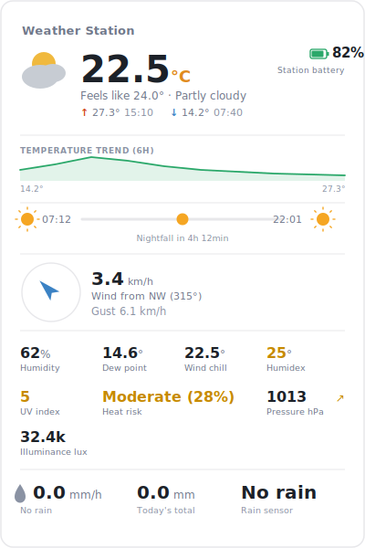
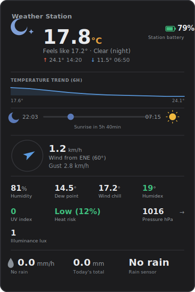

# Ecowitt HUD Card

[](https://github.com/hacs/integration)
[](LICENSE)
[](https://github.com/luisanllo/ecowitt-hud-card/releases)

A custom Lovelace card for Home Assistant, built for Ecowitt weather stations.
Temperature, wind, pressure, rain, and heat/UV risk indices in a single
readable panel — every value is tappable and opens Home Assistant's native
history dialog.

<p align="center">
  
  
</p>
<p align="center"><sub>Light and dark mode — follows your active Home Assistant theme automatically.</sub></p>

## Features

- 🌡️ Current temperature, feels-like, and **today's high/low with the time each occurred**
- 📈 Temperature trend chart for the last few hours
- 🌅 Sun position bar (sunrise/sunset) with a live marker and countdown
- 🧭 Wind compass with speed, gust, and direction
- ☔ Rain block: intensity, today's total, and rain sensor status
- ⚠️ Automatic color scales for heat risk and UV index
- 👆 Every value opens Home Assistant's native history dialog when tapped
- 🎨 Visual editor — no YAML required
- 🌗 Follows Home Assistant's light/dark theme automatically
- 🌍 UI in English or Spanish, auto-detected from your Home Assistant language

## Installation

### Via HACS (recommended)

1. HACS → **⋮** menu (top right) → **Custom repositories**
2. URL: `https://github.com/luisanllo/ecowitt-hud-card`, category **Dashboard**
3. Search for **"Ecowitt HUD Card"** in HACS → Download
4. Add the resource if HACS doesn't do it automatically:
   - URL: `/hacsfiles/ecowitt-hud-card/ecowitt-hud-card.js`
   - Type: JavaScript Module

### Manual

1. Download [`ecowitt-hud-card.js`](ecowitt-hud-card.js) to `config/www/`
2. Settings → Dashboards → **⋮** menu → Resources → add:
   - URL: `/local/ecowitt-hud-card.js`
   - Type: JavaScript Module

## Configuration

Add a card with `type: custom:ecowitt-hud-card`, either through the visual
editor or in YAML. Only `temperature` is required — every other field is
optional, and the card automatically hides whatever you don't fill in.

| Option | Required | Description |
|---|---|---|
| `temperature` | Yes | Current temperature sensor |
| `name` | No | Title shown on the card |
| `apparent_temperature` | No | Feels-like temperature |
| `weather_condition` | No | Condition entity (text like `sunny`, `cloudy`...) |
| `battery` | No | Station battery level |
| `dew_point` | No | Dew point |
| `wind_chill` | No | Wind chill |
| `humidex` | No | Humidex |
| `heat_index` | No | Heat stress index (% or °, auto-detected) |
| `humidity` | No | Relative humidity |
| `pressure` | No | Atmospheric pressure |
| `pressure_trend` | No | Pressure trend (rising/falling/steady) |
| `uv_index` | No | UV index |
| `illuminance` | No | Illuminance (lux) |
| `wind_speed` | No | Wind speed |
| `wind_gust` | No | Gust speed |
| `wind_direction` | No | Wind direction (degrees) |
| `rain_rate` | No | Rain intensity (mm/h) |
| `rain_today` | No | Today's accumulated rain (mm) |
| `moisture` | No | Rain/moisture sensor (binary_sensor or sensor) |
| `show_trend` | No | Show the trend chart (`true` by default) |
| `trend_hours` | No | Hours of history in the chart (`6` by default) |

### Example

```yaml
type: custom:ecowitt-hud-card
name: Weather Station
temperature: sensor.my_station_temperature
apparent_temperature: sensor.my_station_apparent_temperature
weather_condition: sensor.my_station_weather_condition
battery: sensor.my_station_battery
dew_point: sensor.my_station_dew_point
wind_chill: sensor.my_station_wind_chill
humidex: sensor.my_station_humidex
heat_index: sensor.my_station_heat_stress
humidity: sensor.my_station_humidity
pressure: sensor.my_station_pressure
pressure_trend: sensor.my_station_pressure_trend
uv_index: sensor.my_station_uv_index
illuminance: sensor.my_station_illuminance
wind_speed: sensor.my_station_wind_speed
wind_gust: sensor.my_station_gust_speed
wind_direction: sensor.my_station_wind_direction
rain_rate: sensor.my_station_rain_rate
rain_today: sensor.my_station_precipitation
moisture: binary_sensor.my_station_rain_status
```

## Technical notes

- The trend chart and daily high/low require `temperature` to have recorder
  history in Home Assistant.
- The sun bar uses Home Assistant's `sun.sun` entity; no extra configuration
  needed.
- `heat_index` is interpreted as a percentage risk score (0-100%) if the
  sensor's unit is `%` or the value falls in that range; otherwise it's
  treated as a degree-based index.
- The card's language follows `hass.language` / `hass.locale.language`:
  Spanish if it starts with "es", English otherwise. Only these two
  languages are supported for now.

## Contributing

This is a personal project, but bug reports and suggestions are welcome —
open an [issue](https://github.com/luisanllo/ecowitt-hud-card/issues) or a
pull request.

## License

[MIT](LICENSE)
